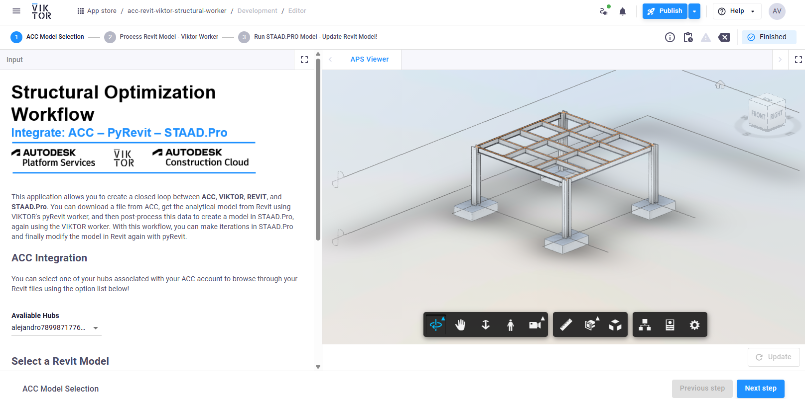
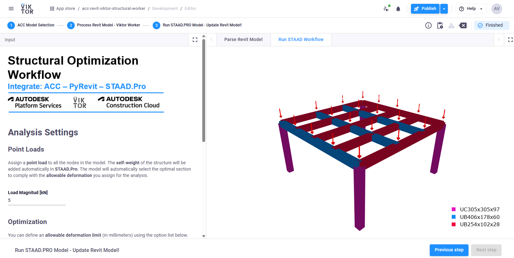
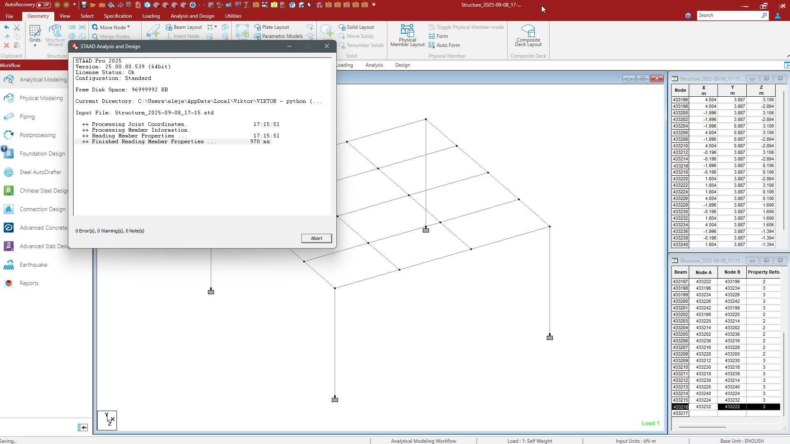
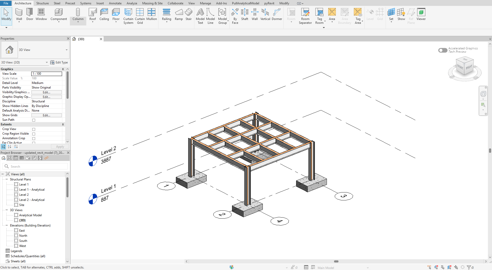

# App Workflow

1. Select Model (Step 1)
  - Pick a Hub, then a Revit file (URN) and an optional 2D/3D view.
  - The viewer loads the selected view.
  - The original RVT is downloaded once to `app/downloaded_files/`.




2. Convert Model (Step 2)
  - Runs the worker (`revit_worker.py`) to produce `output.json` (analytical members).
  - Parses members into nodes / lines / cross sections / members and renders a 3D Plotly scene.
  - Errors are collected (not crashing early) via `StepErrors`.




3. Run STAAD.PRO Model (Step 3)
  - Loads `output.json`.
  - runs app\run_staad_model.py
  - Re-parses and re-plots the model for instant feedback.



4. Update Revit Model (Download button in Step 3)
  - Runs the update worker (`revit_worker_edit.py`) with both files.
  - Receives `updated_model.rvt`, saves it, returns it as a download.




# How to Use the App
## Install VIKTOR App

First, download the integration repository into your local `viktor-apps` folder.

```powershell
# Go to viktor-apps directory
cd ~/viktor-apps

# Clone the repository
git clone https://github.com/AlejoDuarte23/acc-pyrevit-viktor-workers-integration.git
```

This will add the VIKTOR-ACC-Pyrevit integration app to your local workspace.

---

## Set up a PythonWorker

The workers require only two Python libraries: `comtypes` and `pywin32`.

```bash
# Activate your PythonWorker environment and install dependencies
pip install comtypes pywin32
```

This ensures that Python can connect and communicate with STAAD.Pro.

---

## Modify STAAD.Pro Version

STAAD.Pro always installs in the same location, but the year in the path must match your installed version. In the app, the default is 2025. Change it if your version differs.

```python
self.staad_path = ( ... or r"C:\Program Files\Bentley\Engineering\STAAD.Pro 2025\STAAD\Bentley.Staad.exe")
```

**Important:** Make sure no pop-ups appear when launching STAAD.Pro, otherwise the worker will be interrupted. If the computer is slow, adjust the sleep time in `launch_and_connect` inside `app\run_staad_model.py`.

---

## Install PyRevit

Install PyRevit using the instructions provided in the following video:
[PyRevit Installation Guide](https://www.youtube.com/watch?v=dYu9Mtss3-w)

```bash
# Quick check
pyrevit --version
```

This confirms that PyRevit is correctly installed.

---

## Install PyRevit Extensions

The extension repository includes two components: `ExportAnalytical.pushbutton` and `UpdateModelFeatures.pushbutton`. Both are in the same repository.

```powershell
# Go to the pyRevit extensions folder
cd "$env:APPDATA\pyRevit-Master\extensions"

# Clone your repository
git clone https://github.com/AlejoDuarte23/pyrevit-structural-analysis-extension.git

# Rename the cloned folder to match the pyRevit extension naming convention
Rename-Item -Path "pyrevit-structural-analysis-extension" -NewName "PullAnalyticalModel.extension"
```

The worker resolves the location of the extension as follows:

```python
# app\revit_worker.py
PYREVIT_SCRIPT: Path = Path(os.environ["APPDATA"]) / "pyRevit-Master" / "extensions" / "PullAnalyticalModel.extension" / "PullAnalyticalModel.tab" / "Exports.panel" / "ExportAnalytical.pushbutton" / "script.py"
```

```python
# app\revit_worker_edit.py
PYREVIT_SCRIPT: Path = Path(os.environ["APPDATA"]) / "pyRevit-Master" / "extensions" / "PullAnalyticalModel.extension" / "PullAnalyticalModel.tab" / "Exports.panel" / "UpdateModelFeatures.pushbutton" / "script.py"
```

These paths ensure that both the analytical export and model update tools work correctly within PyRevit.
